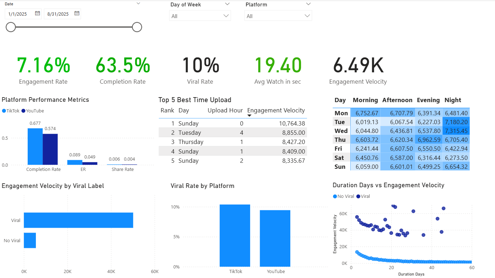

# TikTok vs YouTube Short Analytics Dashboard 2025

---

## 📌 Overview

This project analyzes short-form video performance on TikTok and YouTube in 2025 using Python and Power BI.

The dashboard explores virality patterns, engagement behavior, and the best upload timing through interactive visualizations.

## Target Users

This dashboard is designed for social media teams, digital marketers, and content strategists who want to optimize short-form video performance across TikTok and YouTube Shorts.

## 📈 Dashboard Preview

Provides a high-level summary of platform performance, including:
- Engagement Rate
- Completion Rate
- Viral Rate
- Average Watch Time
- Engagement Velocity

Additional insights include:
- Platform comparison metrics
- Top upload timing
- Upload heatmap
- Viral vs non-viral engagement analysis
- Engagement velocity distribution

## ❓Business Problems

Short-form video platforms generate highly competitive content ecosystems where creators and brands struggle to determine:
- What drives viral performance
- Which platform provides stronger engagement
- When audiences are most active
- How long does viral momentum last
- Which content characteristics improve retention
Without data-driven insights, content strategies often rely on trial and error.

---
## 🎯 Objective

This project is designed to:
- Compare TikTok and YouTube Shorts performance
- Discover optimal upload timing
- Identify factors influencing viral content
- Analyze engagement velocity behavior
- Provide actionable recommendations for improving short-form content performance

---
## 📂 Data Overview

- **Source**: YouTube/TikTok Trends Dataset  2025 (Kaggle)  
- **Period**: January - August 2025
- **Scope**: Short-form video performance analysis across TikTok and YouTube Shorts, focusing on engagement metrics, virality, upload timing, and audience retention behavior.

### Key Columns
- `platform`  
- `engagement_rate`
- `completion_rate`  
- `engagement_velocity`  
- `avg_watch_time_sec`  
- `publish_dayofweek`  
- `upload_hour`  
- `genre`
- `creator_tier` 
- `trend_duration_days`

---

## 🛠 Tools & Technologies

* Python (Pandas) – Data cleaning and Exploratory data analysis (EDA)
* Power BI – Data visualization and dashboard creation

---

## 🔄 Project Workflow

---

## 📊 Key Features

* **📱 TikTok vs YouTube Shorts Performance **
- Platform engagement comparison
- Completion rate analysis
- Share rate comparison
- Engagement velocity comparison
- Watch time performance evaluation

* **⏰ Time Analysis **
- Upload heatmap visualization
- Best upload timing identification
- Day of week performance
- Publish period performance

* **🔥 Viral Analysis **
- Viral vs non-viral content comparison
- Engagement velocity analysis
- Viral content on each platform analysis

* **⚡ Velocity Analysis**
- Engagement velocity trend analysis
- Viral vs non-viral momentum comparison
- Content lifespan evaluation
- Trend duration performance analysis 

---

## 🔍 Key Insights

- TikTok consistently outperformed YouTube Shorts in overall engagement performance.
- Videos uploaded during the night until early morning hours and weekends tended to achieve stronger engagement results.
- Viral videos showed higher engagement velocity than non-viral content.
- The upload schedule played a significant role in content performance and audience interaction.
- Viral videos gain engagement quickly but usually last for a shorter time, while non-viral videos grow more slowly and last longer.

---

## 🚀 Business Recommendation

- Prioritize TikTok for campaigns focused on maximizing engagement and audience interaction, as the platform consistently showed stronger engagement performance than YouTube Shorts.

- Schedule uploads during high-performing periods, especially at night, early morning hours, and weekends, to improve visibility and engagement potential.

- Monitor engagement velocity shortly after upload to quickly identify content with viral potential and optimize promotion strategies in real time.

- Use platform-specific content strategies instead of reposting identical content across platforms, since audience behavior and engagement patterns differ between TikTok and YouTube Shorts.

---

## 📝 Conclussion
This project shows how data analysis can help optimize short-form video strategies by identifying the factors affecting engagement, virality, and upload timing across TikTok and YouTube Shorts. The dashboard provides actionable insights to support better content decisions for social media and marketing teams.  

